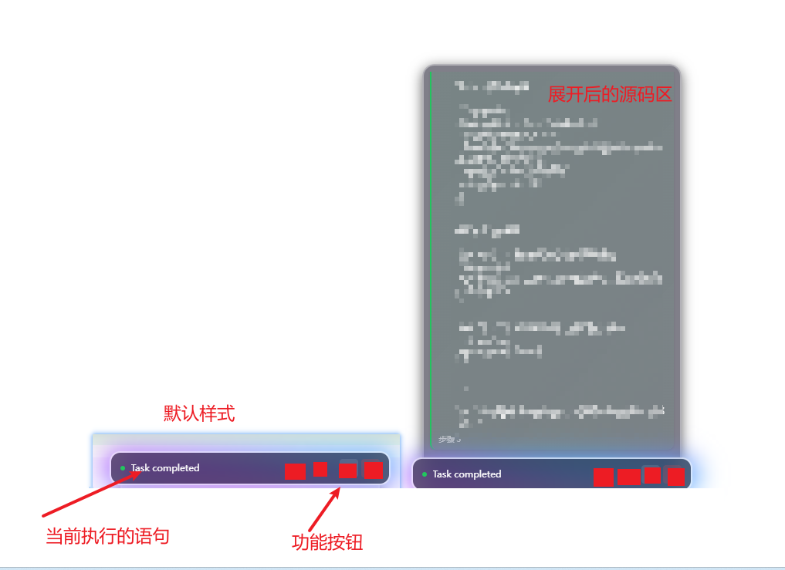
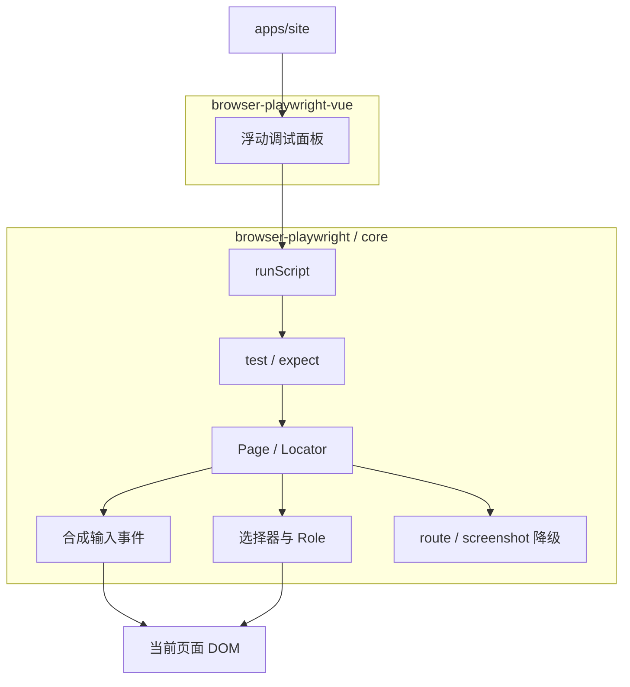

# browser-playwright 落地计划

## 现状

- Monorepo 已在 [`browser-playwright/`](browser-playwright/)：`packages/core`、`packages/browser-playwright-vue`、`apps/site` 均为 Vite 模板，**尚无业务实现**。
- 参考源码在 [`playwright-main/`](playwright-main/)（只读，禁止修改）。
- 根目录 [`AGENT.md`](AGENT.md) 目前仅有目录说明，需补齐开发规范。
- 根脚本 `dev` 指向 `website#dev`，与实际包名 `site` 不一致，需一并修正。

## 目标产物

| 包 | 职责 | 对外名 |
|---|---|---|
| [`packages/core`](browser-playwright/packages/core) | Page/Locator/expect/test + `runScript` | 发布名改为 `browser-playwright`（对齐 README 用法） |
| [`packages/browser-playwright-vue`](browser-playwright/packages/browser-playwright-vue) | 浮动调试 UI，驱动 `runScript` 有参考图 | `browser-playwright-vue` |
| [`apps/site`](browser-playwright/apps/site) | 演示页 + 嵌入 Vue 调试组件跑示例脚本 | 内部测试工程 |

browser-playwright-vue组件参考图： ， 色调以 #1476ff 为主色。

## 架构

**核心决策（已拍板）：**

1. **不实现** Browser / BrowserServer / launch / CDP；`page` 始终绑定当前 `window`/`document`。
2. **选择器与 getByRole**：移植/改编官方页内实现（[`playwright-main/packages/injected`](playwright-main/packages/injected)、[`playwright-main/packages/isomorphic`](playwright-main/packages/isomorphic)），尤其 `roleUtils` / `roleSelectorEngine` / `consoleApi`——Role **可纯页面获取**，不做假模拟。
3. **鼠标/键盘**：对齐 [`webview/webViewInput.ts`](playwright-main/packages/injected/src/webview/webViewInput.ts) 的合成序列（pointer → mouse → click），接近真实但 `isTrusted=false`。
4. **定时器**：只用真实 `setTimeout`/`setInterval`，不移植 Clock。
5. **网络**：用 `fetch`/`XHR` 拦截（MSW 风格或自研 hook）仿 `page.route`；文档标明无法覆盖完整导航级 CDP Fetch。
6. **截图**：视口/元素用 DOM→canvas（如 `html-to-image`）；`toHaveScreenshot` 做基础像素/哈希对比，不承诺与官方 CDP 像素一致。
7. **`page.goto`**：页内场景解释为同应用内路由/hash 导航（或 `location` 赋值），非跨进程新页；在 site 演示里用前端路由验证。

## 分阶段实现

### Phase 0 — 工程与规范

- 将 `packages/core` 改为可发布库形态：`exports`、`main`/`types`、库模式 Vite/tsconfig；包名 `browser-playwright`。
- `browser-playwright-vue` 改为组件库构建（外部化 `vue` + 依赖 workspace `browser-playwright`）。
- 修正根 `dev` → `site#dev`；site 依赖两个 workspace 包。
- **重写根 [`AGENT.md`](AGENT.md)**：目录约定、禁止改 `playwright-main`、API 对齐原则、事件合成规范、能力边界（route/screenshot）、代码风格与提交范围。

### Phase 1 — Page / Locator 骨架

- 实现 `Page`、`Locator`、`FrameLocator`（同源 iframe 优先）。
- 对齐常用查询：`locator`、`getByRole`、`getByText`、`getByTestId`、`getByPlaceholder`、`getByLabel`、`getByAltText`、`getByTitle`、`filter`、`first`/`nth`/`last`、`and`/`or`。
- Auto-wait：动作前轮询可见/可点（真实定时器 + timeout）。
- 参考：`client/locator.ts` API 形状 + `injected/consoleApi.ts` 查询思路。

### Phase 2 — 输入与页面事件

- `click` / `dblclick` / `hover` / `fill` / `type` / `press` / `check` / `selectOption` / `focus` / `blur`。
- 事件顺序按真实浏览器合成：`pointerdown` → `mousedown` → `pointerup` → `mouseup` → `click`（及 hover 的 over/enter/move）。
- `page.on('pageerror' | 'console' | …)`：挂 `window.onerror` / `unhandledrejection` / console hook。
- `page.evaluate` / `addInitScript`（页内直接执行；init 在库装载后对后续导航尽力而为）。

### Phase 3 — expect + test fixture

- `expect(locator).toHaveText / toBeVisible / toHaveCount / toHaveAttribute / toBeChecked / …`，带 auto-retry。
- `test(name, fn)` + fixture `{ page }`（当前页适配器）；收集 pass/fail/错误信息，产出与 Playwright 类似的汇总结果结构。
- 导出：`import { test, expect } from 'browser-playwright'`。

### Phase 4 — 网络与截图（降级）

- `page.route` / `unroute`：拦截 fetch + XHR；`Route.fulfill/abort/continue`。
- `page.screenshot` / `locator.screenshot` + 简易 `toHaveScreenshot`。
- 在类型/文档中标注能力边界。

### Phase 5 — `runScript`

- `runScript(script: string, options?)`：无框架依赖。
- 解析策略：将脚本包进 async 函数，注入 `test`/`expect`/`page`；**按顶层 await / 语句边界**步进（用轻量变换或行级断点代理），每步 `emit('step', { line, status })`。
- 控制能力：`play` / `pause` / `step` / `stop`；返回 Promise\<TestResult\>。
- 安全默认：仅信任调用方传入脚本（同页执行，等同 `eval` 信任模型）。

### Phase 6 — Vue 调试组件

- 组件 props：`script: string`，可选 `autoPlay`。
- 浮动面板：高亮当前执行行、播放 / 暂停 / 单步 / 下一步、断言成功失败列表、结束汇总（passed/failed）。
- 样式自包含，避免污染宿主；`Teleport` 到 `body`。

### Phase 7 — site 演示验收

- 搭一个含按钮/弹窗/文案的小页面。
- 跑 README 同类脚本：`getByRole` → `click` → `toHaveText`。
- 嵌入 Vue 调试组件，验证步进与结果展示。

## 参考源码（只读）

优先阅读、移植思路，不整包拷贝无关 runner：

- 输入：`playwright-main/packages/injected/src/webview/webViewInput.ts`
- Role：`.../roleUtils.ts`、`roleSelectorEngine.ts`
- Locator 页内原型：`.../consoleApi.ts`
- expect 页内比较：`.../injectedScript.ts`（expect 段）
- API 形状：`playwright-main/packages/playwright-core/src/client/{page,locator}.ts`

## 非目标（明确不做）

- Browser / BrowserServer / 多浏览器启动
- CDP 可信输入、完整网络栈拦截
- 模拟 Clock
- 修改 `playwright-main` 任何文件
