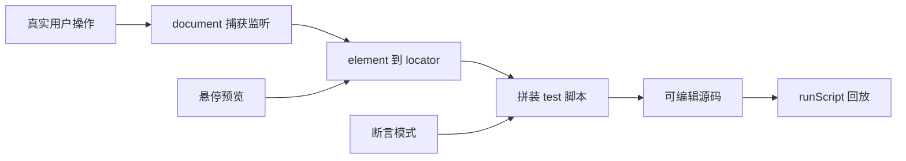

# 页内录制 / Codegen 实现计划

## 背景与边界

本库是**页内** Playwright 兼容层，无法复用官方 `npx playwright codegen`（依赖 Node + CDP）。目标是自建同源能力：监听真实用户操作 → 生成可被现有 `runScript` 执行的脚本。



## 一、Core：新建 `recorder` 模块

目录：[`packages/core/src/recorder/`](browser-playwright/packages/core/src/recorder/)

| 文件 | 职责 |
|------|------|
| `generateLocator.ts` | Element → 稳定 locator 源码字符串 |
| `codegen.ts` | 动作/断言 → 脚本行；组装完整 `test(...)` |
| `recorder.ts` | 启停录制、事件捕获、悬停预览、断言模式 |
| `types.ts` | `RecordedAction`、`RecorderOptions`、`RecorderController` |

### 公开 API（从 [`packages/core/src/index.ts`](browser-playwright/packages/core/src/index.ts) 导出）

```ts
const rec = startRecording({
  testTitle?: string,          // 默认 'recorded'
  onUpdate?: (script: string, actions: RecordedAction[]) => void,
})
rec.setAssertMode(true)        // 下次点击生成 expect
rec.pause() / rec.resume()
const { script, actions } = rec.stop()
```

生成脚本形态固定为：

```ts
import { test, expect } from 'browser-playwright'

test('recorded', async ({ page }) => {
  await page.getByRole('button', { name: '打开弹窗' }).click()
  await expect(page.getByText('show 事件触发了')).toBeVisible()
})
```

### Locator 生成优先级（`generateLocator.ts`）

对 `Event.target` 向上找可交互/有语义节点，依次尝试并**用现有查询引擎验证唯一性**（复用 `page.locator(...).count()` 或 selectors 查询）：

1. `getByRole(role, { name })` — 复用 [`roleUtils.ts`](browser-playwright/packages/core/src/vendor/injected/roleUtils.ts) 的 accessible name
2. `getByTestId` — `getTestIdAttribute()`
3. `getByLabel` / `getByPlaceholder` / `getByAltText` / `getByTitle`
4. `getByText`（短文本、唯一时）
5. 降级：稳定 CSS（`id` → 简短 class 链 → `nth-child` 路径）

输出形如 `page.getByRole('button', { name: '提交' })`，必要时追加 `.filter({ hasText })` / `.nth(n)`。

不移植官方完整 `asLocator`；自写轻量版，足够覆盖演示站与常见表单。

### 事件捕获（`recorder.ts`）

在 `document`（及后续可扩展同源 iframe）**捕获阶段**监听：

| 用户操作 | 生成语句 |
|----------|----------|
| click（非输入类） | `.click()` |
| dblclick | `.dblclick()` |
| input/change（text/textarea/select） | `.fill(value)` / `.selectOption(...)` |
| checkbox/radio | `.check()` / `.uncheck()` |
| keydown Enter/Tab/Escape（输入框内） | `.press('Enter')` 等 |
| 断言模式 + click | `await expect(locator).toBeVisible()`（默认；UI 可切 `toHaveText`） |

关键约束：

- 只录 `event.isTrusted === true`，避免录到 `SyntheticInput` / `runScript` 回放
- 忽略带 `data-bpw-ui`（或同类标记）的调试面板自身节点
- 录制中用轻量 overlay 做**悬停高亮 + tooltip 显示候选 locator**（可参考现有 [`locator.highlight`](browser-playwright/packages/core/src/locator.ts) 的 `x-bp-highlight` 思路，但用独立 `x-bp-recorder-highlight`，避免与回放高亮冲突）
- `fill` 防抖合并：同一控件连续输入合并为一次最终值

### 不改动的边界

- 不把交互事件塞进现有 `page.on`（仅 `console` / `pageerror`）
- 不实现 Node 侧 `codegen` CLI
- `page.pickLocator` 可在本期改为委托 `recorder` 的点选一次返回 locator 字符串（可选小增强）；若工期紧可仍保持 `notSupported`，录制面板已覆盖点选预览

## 二、Vue：扩展调试面板为 Inspector

改 [`BrowserPlaywrightDebugger.vue`](browser-playwright/packages/browser-playwright-vue/src/components/BrowserPlaywrightDebugger.vue)：

**模式切换：** `Playback` | `Record`

| 能力 | 行为 |
|------|------|
| Record 开/关 | 调用 core `startRecording` / `stop`；工具栏红点按钮 |
| 悬停预览 | 录制开启时由 core overlay 显示 locator |
| 断言模式 | 「Assert」切换；再点页面元素追加 `expect(...).toBeVisible()` |
| 可编辑脚本 | 展开区由只读改为 `<textarea>` / contenteditable；`v-model` 本地 `scriptText` |
| 录制 → 回放 | `onUpdate` 写入 `scriptText`；切回 Playback 用当前文本 `runScript` |
| Props | `script` 改为可选初始值；新增 `emit('update:script', string)` 便于演示站同步 |

根节点加 `data-bpw-ui`，保证录制不会点到面板自己。

演示站 [`apps/site/src/App.vue`](browser-playwright/apps/site/src/App.vue)：挂载组件时可去掉硬编码长脚本依赖，保留短初始脚本或空 `test` 骨架，方便现场录制验收。

## 三、文档与导出

- [`packages/core/README.md`](browser-playwright/packages/core/README.md)：新增「录制 / Recorder」小节（API、生成格式、与官方 codegen 差异）
- [`packages/browser-playwright-vue/README.md`](browser-playwright/packages/browser-playwright-vue/README.md)：Record / Assert / 编辑 / 回放操作说明
- 更新两边 `package.json` 若有必要的 exports（通常无需）

## 四、建议实现顺序

1. `generateLocator` + 单元可手动在演示页验证唯一性
2. `recorder` 事件捕获 + codegen 输出 `test()` 脚本
3. 悬停高亮 + assert 模式
4. Vue 面板 UI 接线 + 可编辑源码
5. site 演示验收 + README

## 关键复用点

- 查询/唯一性校验：现有 `Page` / `Locator` / selectors
- Accessible name：`vendor/injected/roleUtils`
- 回放闭环：已有 `runScript` + Debugger 播放控件
- 高亮思路：`locator.highlight`（独立 overlay 元素名）
